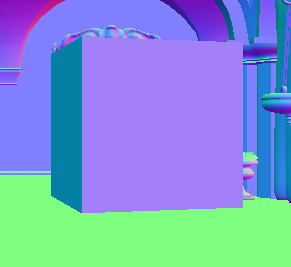
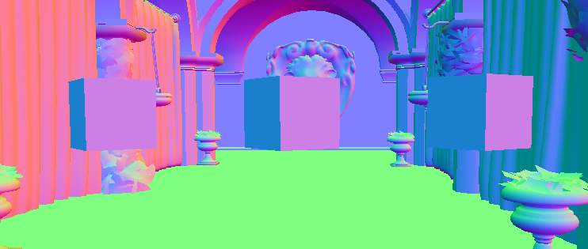
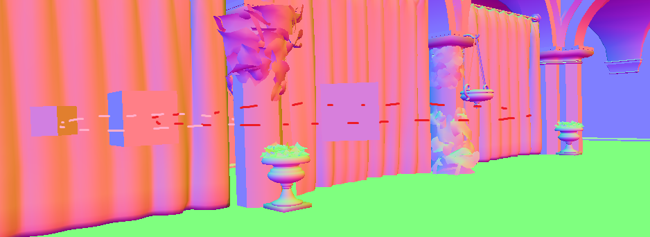

Chris Illy Culling

Lab report for DA307A Assignment 1

2 April 2025

---

# 1. Cube

To make the `Cube` class, I started by copying the `QuadModel` class verbatim, only renaming `quad` to `cube`. I added respective lines in the `scene` for our new "`Cube`" and then added lines to render it the same way the `QuadModel` does. After commenting out `m_quad->Render()`, there was still a cube (quad) rendering on screen. Success!

Slowly I started adding more vertices. Changing the `TexCoord`s did nothing. The SOUTH face I added rendered correctly, but I only managed to render one of the two triangles of the FRONT face.

```cpp
Vertex v0, v1, v2, v3, 
	v4, v5, v6, v7,
	v8, v9, v10, v11,
	v12, v13, v14, v15,
	v16, v17, v18, v19,
	v20, v21, v22, v23;

// Back face (original face, used as reference)
v0.Position = { -0.5, -0.5f, 0.5 };
v0.Normal = { 0, 0, 1 };
v0.TexCoord = { 0, 0 };

v1.Position = { 0.5, -0.5f, 0.5 };
v1.Normal = { 0, 0, 1 };
v1.TexCoord = { 0, 1 };

v2.Position = { 0.5, 0.5f, 0.5 };
v2.Normal = { 0, 0, 1 };
v2.TexCoord = { 1, 1 };

v3.Position = { -0.5, 0.5f, 0.5 };
v3.Normal = { 0, 0, 1 };
v3.TexCoord = { 1, 0 };

// Front face - facing the wrong direction
v8.Position = { 0.5, 0.5f, -0.5 };
v8.Normal = { 0, 0, -1 };
v8.TexCoord = { 0, 0 };

v9.Position = { -0.5, 0.5f, -0.5 };
v9.Normal = { 0, 0, -1 };
v9.TexCoord = { 0, 1 };

v10.Position = { -0.5, -0.5f, -0.5 };
v10.Normal = { 0, 0, -1 };
v10.TexCoord = { 1, 1 };

v11.Position = { 0.5, -0.5f, -0.5 };
v11.Normal = { 0, 0, -1 };
v11.TexCoord = { 1, 0 };

// South Face
v20.Position = { -0.5, -0.5, -0.5 };
v20.Normal = { 0, -1, 0 };
v20.TexCoord = { 0, 0 };

v21.Position = { 0.5, -0.5, -0.5 };
v21.Normal = { 0, -1, 0 };
v21.TexCoord = { 0, 1 };

v22.Position = { 0.5, -0.5, 0.5 };
v22.Normal = { 0, -1, 0 };
v22.TexCoord = { 1, 1 };

v23.Position = { -0.5, -0.5, 0.5 };
v23.Normal = { 0, -1, 0 };
v23.TexCoord = { 1, 0 };
```

For some reason, the FRONT face, is rendering in the wrong direction. Maybe it's due to the way I'm pushing them back to `indices`? `TexCoord`s? `Position`? It can't be the `Normal`...

After some tinkering, I realised that it was the *order* in which I was pushing back the vertices into the `indices` that caused the incorrect face orientation, independent of the vertex normals.



# 2. Camera Control

In order to implement the camera controls, I added Rotate methods in the `camera` class.

```cpp
void Camera::RotateX(const float mousedx)
{
	m_rotation.x += mousedx;
}

void Camera::RotateY(const float mousedy)
{
	m_rotation.y += mousedy;
}
```

I also updated it `WorldToViewMatrix()` to include a `mat4f::rotation()` in its calculations, using a new `m_rotation` variable which is updated whenever we move the mouse. The mouse input logic and sensitivity is handled in `scene.cpp`.

```cpp
mat4f Camera::WorldToViewMatrix() const noexcept
{
	return mat4f::translation(-m_position) * mat4f::rotation(0, m_rotation.x, m_rotation.y);
}
```

The only funky thing with the result is that the rotation happens around an origin point rather than rotating around the camera itself. In order to rotate around the camera instead of an origin point, I reverse the matrix multiplication order.

```cpp
return mat4f::rotation(0, m_rotation.x, m_rotation.y) * mat4f::translation(-m_position);
```

However, when moving the the mouse downward, the camera rotates down (from the players point of view) when facing one direction, but rotates upward when facing another. This is because it's rotating the same direction/way, regardless of player orientation.

# 3. Hierarchical Transformations

I started out by making two identical copies of my `m_cube`, which I've named `m_orbiterCube` and `m_orbiterCube2`. I instantiate and render them in exactly the same way. I only edited their translation transform to render them in different places, making sure they all exist and render as intended.



Then, to get our first `m_orbiterCube` to orbit our original `m_cube`, we can simply multiply their transforms.

```cpp
m_orbiterCube_transform = m_cube_transform * m_orbiterCube_transform;
```

Then, in order to get `m_orbiterCube2` to orbit `m_orbiterCube` while `m_orbiterCube` itself is orbiting `m_cube`, we multiply `m_orbiterCube2`'s transform in exactly the same way, parenting `m_orbiterCube` to it this time.

```cpp
m_orbiterCube2_transform = m_orbiterCube_transform * m_orbiterCube2_transform;
```

### Illustrated Result


<!-- # 4. OBJ-export & Import -->
