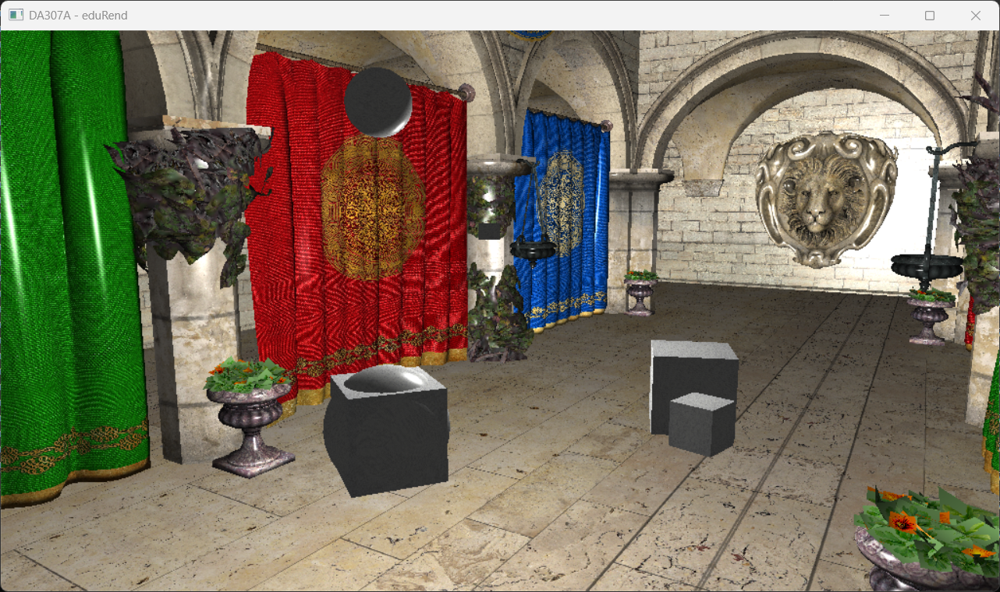
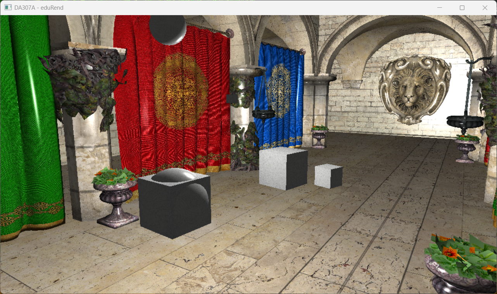
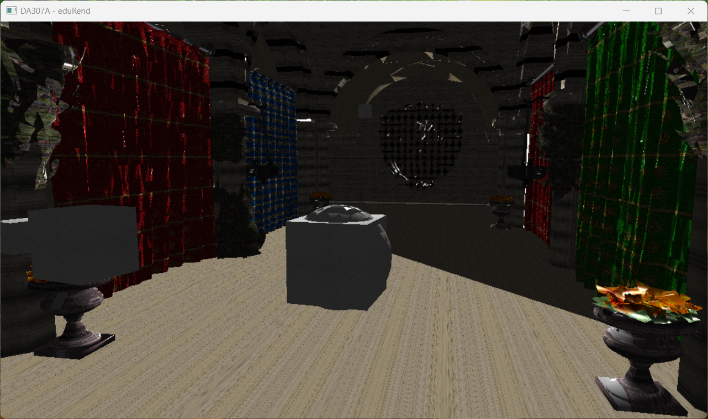
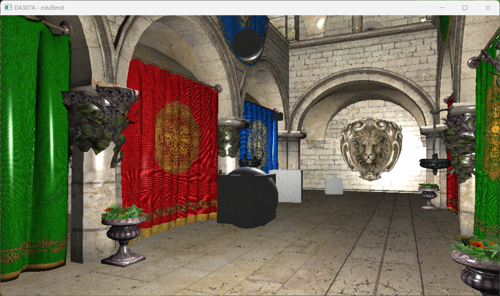
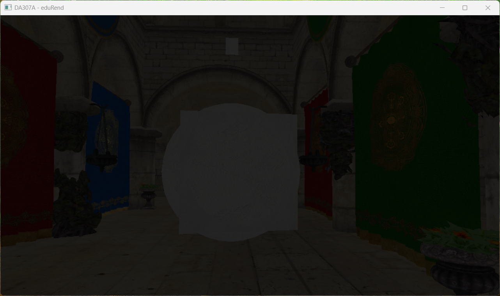

## Testing Different Pixel Shader Calculations

### Result 1
```hlsl
reflectionVector = reflect(-lightNormal, normal);
reflectionAngle = max(dot(reflectionVector, cameraNormal), 0.0f);
```


### Result 2
```hlsl
reflectionVector = reflect(lightVector, normal);
reflectionAngle = max(0, -dot(reflectionNormal, cameraNormal));
```


The results are visually indistinguishable.

## Adding Normal Maps

I added `float3 Tangent` and `float3 Binormal` to the `PSIn` alongside respective calculations in the pixel shader, but forgot to actually pass anything from the vertex shader which resulted in these (flickering) visuals 🐡



Adding `Tangent` and `Binormal` to the vertex shader fixed this issue:



At first, when trying to render my normal maps (having updated the `OBJModel` constructor and its `Render()` method), the diffuse and specular components seem to visually disappear. Because of this, the effects of the normal maps cannot be observed.



When rendering only the `Tangent` and `Binormal`s, I get a black screen. *I think this might be the cause of the issue.* Looking back at the assignment instructions' first bullet-point,

- Compute T and B for each vertex.

I now realise what I missed 🤧 (I thought the engine was already doing that 🤡)
